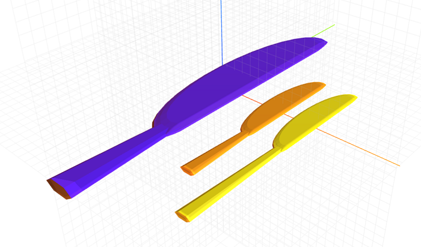

# craft-knife

Parameterized knife model.

### Usage
```html
<craft>
    <craft name="knife" module="craft-knife"/>
    <knife></knife>
</craft>
```

### Parameters
- length: adjusts length of knife

### Example
```html
<craft>
    <craft name="knife" module="craft-knife"/>
    <row spacing="2">
        <knife length="15" transform="scale(2,2,2)"></knife>
        <knife length="20"></knife>
        <knife></knife>
    </row>
</craft>
```

